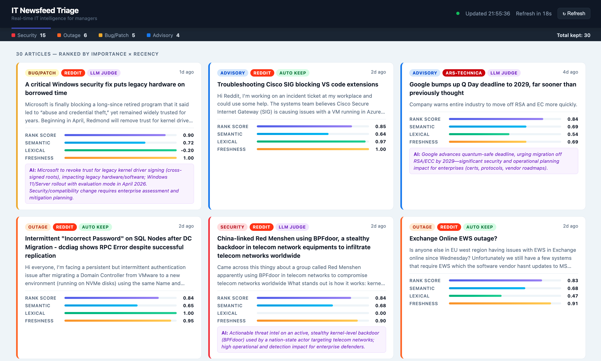
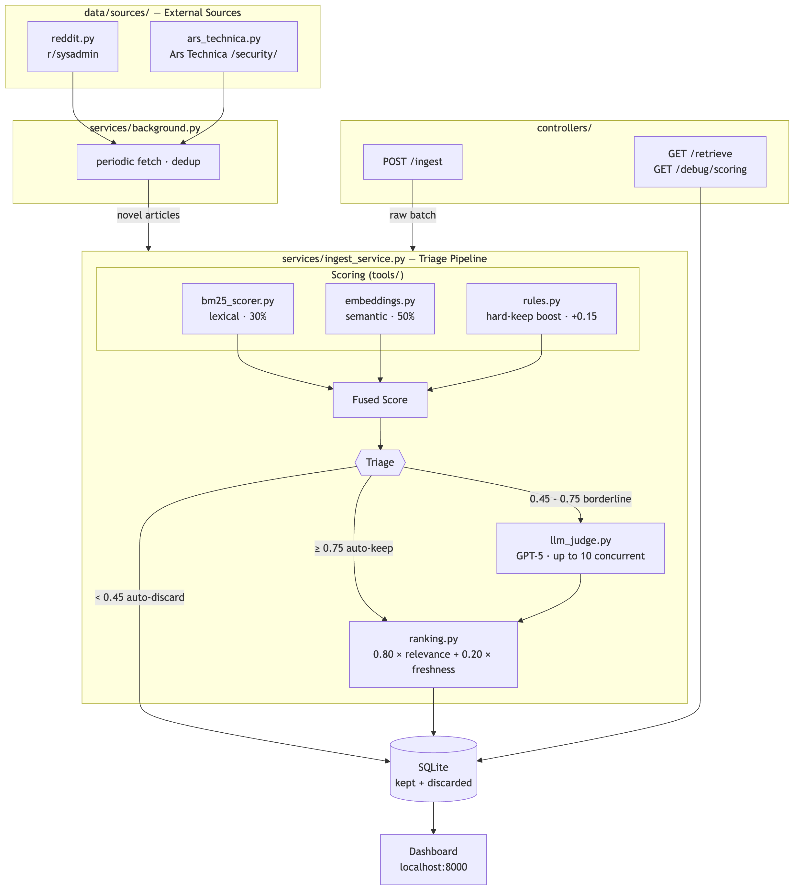

# IT Newsfeed Triage System  <!-- omit in toc -->

A real-time IT news aggregation and filtering pipeline for enterprise IT managers. Fetches articles from Reddit and Ars Technica, scores them for relevance, and surfaces only what matters — outages, security incidents, critical bugs, and vendor advisories.

- [UI overview](#ui-overview)
- [Functionality](#functionality)
- [Architecture](#architecture)
- [Workflow](#workflow)
- [Folder Structure](#folder-structure)
- [Setup](#setup)
- [API Endpoints](#api-endpoints)
  - [POST /ingest](#post-ingest)
  - [GET /retrieve](#get-retrieve)
  - [GET /debug/scoring](#get-debugscoring)
- [Monitoring](#monitoring)
- [Dashboard](#dashboard)
- [Adding a New Source](#adding-a-new-source)
- [Expanding Vocabulary](#expanding-vocabulary)
---
## UI overview


---

## Functionality

- **Aggregation** — continuously fetches from Reddit (`r/sysadmin`) and Ars Technica (`/security/`) on a configurable interval
- **Filtering** — hybrid scoring pipeline: BM25 lexical + OpenAI semantic embeddings + freshness, with an LLM judge for borderline articles
- **Ranking** — kept articles ranked by importance × recency
- **API** — two REST endpoints for the Nexthink mock newsfeed contract (`/ingest`, `/retrieve`)
- **Dashboard** — live web UI at `http://localhost:8000`

---

## Architecture



---

## Workflow

```
startup
  └── IngestService warms up (precomputes category embeddings via OpenAI)
  └── background fetch loop starts

every N minutes (background)
  └── Reddit + Ars Technica fetched
  └── deduplicate against DB (skip already-seen articles)
  └── novel articles → scoring pipeline → DB

on POST /ingest (on-demand)
  └── synthetic articles pushed in by test harness or manually
  └── same scoring pipeline → DB

GET /retrieve
  └── reads DB → returns kept articles ranked by importance × recency
```

**Scoring pipeline per article:**

```
BM25 lexical score   (30%)  ─┐
Semantic score       (50%)  ─┼─► fused score ──► auto-discard  (< 0.45)
Hard-keep boost     (+0.15) ─┘                   auto-keep     (≥ 0.75)
                                                  LLM judge     (0.45–0.75)

kept articles ──► rank_score = 0.80 × relevance + 0.20 × freshness
```

---

## Folder Structure

```
IT_assiatant/
├── main.py                      # Entry point: uvicorn server
├── config.py                    # Thresholds, weights, model names
├── models.py                    # Shared Pydantic schemas (NewsEntry, ScoredNewsEntry)
├── .env.example                 # Example environment variable config
│
├── controllers/                 # HTTP layer — request/response only
│   ├── api.py                   # FastAPI app, lifespan, route mounting
│   ├── ingest.py                # POST /ingest
│   └── retrieve.py              # GET /retrieve, GET /debug/scoring
│
├── services/                    # Business logic
│   ├── ingest_service.py        # Scoring pipeline, triage decisions, DB persist
│   ├── retrieve_service.py      # Read kept articles from DB
│   └── background.py            # Periodic fetch loop
│
├── data/                        # Data layer
│   ├── db.py                    # SQLite operations
│   ├── benchmark.csv            # Ground-truth evaluation dataset
│   └── sources/
│       ├── __init__.py          # SOURCES registry (add new sources here)
│       ├── base.py              # NewsSource abstract base class
│       ├── reddit.py            # RedditSource
│       └── ars_technica.py      # ArsTechnicaSource (parallel article fetching)
│
├── tools/                       # Scoring utilities
│   ├── vocabulary.py            # Expandable term lists (BM25, KEEP_TERMS, prototypes)
│   ├── scorer.py                # Fused score computation
│   ├── bm25_scorer.py           # BM25 lexical scorer
│   ├── embeddings.py            # OpenAI embeddings + cosine similarity
│   ├── llm_judge.py             # GPT judge for mid-range articles
│   ├── ranking.py               # rank_score + sort
│   ├── rules.py                 # Hard-keep keyword rules
│   └── preprocess.py            # Text normalization and building
│
├── analysis/                    # Evaluation notebooks
│   ├── build_benchmark.ipynb
│   ├── evaluate.ipynb
│   └── analysis.ipynb
│
├── tests/
│   ├── test_endpoints.py        # API contract tests for /ingest and /retrieve
│   ├── test_schema.py           # NewsEntry schema validation tests
│   └── test_scoring.py          # Pure scoring function tests (freshness, rank)
│
├── doc/                         # Design documentation
│   ├── reflection.md            # Design reflection, evaluation methodology, and optimisation findings
│   ├── diagram.png              # Architecture diagram
│   └── UI.jpg                   # Dashboard screenshot
│
└── static/
    └── dashboard.html           # Live web dashboard
```

**Run tests**

Before running tests, make sure to set up the environment and dependencies as described in the Setup section below. Then execute the following command from the project root:

```bash
source .venv/bin/activate
python3 -m pytest tests/ -v
```

---

## Setup

**1. Install dependencies**

```bash
python3 -m venv .venv
source .venv/bin/activate
pip install -r requirements.txt
```

**2. Configure environment**

Create a `.env` file in the project root based on `.env.example` and fill in your [OpenAI API key](https://platform.openai.com/settings/organization/api-keys). Adjust thresholds and fetch settings as desired.

```env
OPENAI_API_KEY=sk-...

# Models
OPENAI_EMBEDDING_MODEL=text-embedding-3-small
LLM_JUDGE_MODEL=gpt-5

# Scoring thresholds (see config.py)
# AUTO_DISCARD_THRESHOLD=0.45
# AUTO_KEEP_THRESHOLD=0.75

# Background fetch
ENABLE_BACKGROUND_FETCH=true
FETCH_INTERVAL_MINUTES=10
REDDIT_SUBREDDIT=sysadmin
REDDIT_LIMIT=25
ARS_LIMIT=10
```

**3. Start the server**

```bash
python3 main.py
```

Server starts at `http://localhost:8000`. On startup:
- DB initialised
- Embedding model warmed up
- Background fetch loop started (first cycle runs after 5s)

---

## API Endpoints

### POST /ingest

Ingest a batch of raw news articles through the triage pipeline.

**Request**

```bash
curl -X POST http://localhost:8000/ingest \
  -H "Content-Type: application/json" \
  -d '[
    {
      "id": "unique-id-001",
      "source": "reddit",
      "title": "Critical zero-day in Windows actively exploited in the wild",
      "body": "Microsoft confirms active exploitation of a critical RCE vulnerability affecting all Windows versions.",
      "published_at": "2026-03-29T10:00:00Z"
    },
    {
      "id": "unique-id-002",
      "source": "ars-technica",
      "title": "Best mechanical keyboards for 2026",
      "body": "A buying guide for enthusiasts.",
      "published_at": "2026-03-29T09:00:00Z"
    }
  ]'
```

**Required fields per item**

| Field          | Type   | Description                       |
| -------------- | ------ | --------------------------------- |
| `id`           | string | Unique identifier                 |
| `source`       | string | e.g. `"reddit"`, `"ars-technica"` |
| `title`        | string | Article headline                  |
| `published_at` | string | ISO 8601 UTC timestamp            |
| `body`         | string | Article body (optional)           |

**Response**

```json
{
  "status": "ok",
  "run_id": "3f2a1b...",
  "ingested": 2,
  "kept": 1
}
```

---

### GET /retrieve

Returns all articles the system decided to keep, ranked by importance × recency.

**Request**

```bash
curl http://localhost:8000/retrieve
```

**Response** — array of kept articles sorted by `rank_score` descending:

```json
[
  {
    "article_id": "unique-id-001",
    "source": "reddit",
    "title": "Critical zero-day in Windows actively exploited in the wild",
    "body": "...",
    "published_at": "2026-03-29T10:00:00Z",
    "keep": 1,
    "decision_source": "auto_keep",
    "fused_score": 0.81,
    "rank_score": 0.76,
    "lexical_score": 0.92,
    "semantic_score": 0.88,
    "freshness_score": 0.95,
    "predicted_category": "security_incident",
    "llm_reason": "",
    "llm_relevance_score": 0.0
  }
]
```

---

### GET /debug/scoring

Returns all articles from the latest ingestion run (kept and discarded), sorted by fused score. Useful for inspecting triage decisions.

```bash
curl http://localhost:8000/debug/scoring
```

---

## Monitoring

All components use Python's standard `logging` module. Set `LOG_LEVEL=DEBUG` in `.env` for verbose output; default is `INFO`.

**Startup**
- Embedding model name and number of category prototypes precomputed
- Background fetch task started or skipped

**Per fetch cycle** (`services/background.py`)
- Articles fetched per source, total novel vs already-seen count
- Any per-source fetch failure with exception detail
- Next scheduled interval

**Per ingest batch** (`services/ingest_service.py`)
- Batch summary on completion — one line showing all four decision buckets and final kept count:
  ```
  Batch complete run_id=abc…: 25 in → 4 auto_keep, 8 llm_kept, 9 llm_discarded, 4 auto_discard → 12 kept
  ```
- Per-article decision log: title, fused score, decision type, LLM elapsed time

**Errors**
- Embedding API call failures (model, count of texts) — `tools/embeddings.py`
- LLM judge empty response or JSON/validation failure, both with article title — `tools/llm_judge.py`
- Ars Technica article parse failures per URL

**Scoring debug endpoint**

`GET /debug/scoring` returns all articles from the latest run (kept + discarded) with every score visible — use this to inspect threshold decisions without reading logs. The same data is also accessible in the **Scoring Debug** tab of the web dashboard at `http://localhost:8000`, providing a table view of all scores and decisions without needing to call the API directly.

---

## Dashboard

Open `http://localhost:8000` in a browser for a live view of filtered articles and scoring details.

---

## Adding a New Source

1. Create `data/sources/your_source.py` implementing `NewsSource`:

```python
from data.sources.base import NewsSource

class YourSource(NewsSource):
    source_id = "your-source"

    def fetch(self, limit: int) -> list[dict]:
        # return list of dicts: id, source, title, body, published_at
        ...
```

2. Register it in `data/sources/__init__.py`:

```python
from data.sources.your_source import YourSource

_yours = YourSource()
_yours.default_limit = int(os.getenv("YOUR_LIMIT", "20"))

SOURCES = [_reddit, _ars, _yours]
```

No other files need to change.

---

## Expanding Vocabulary

To improve filtering coverage, edit `tools/vocabulary.py`:

- `CATEGORY_PROTOTYPES` — prototype texts for semantic category matching
- `BM25_QUERY_TERMS` — lexical query terms for BM25 scoring
- `KEEP_TERMS` — hard-keep keyword triggers (bypass LLM gate)
